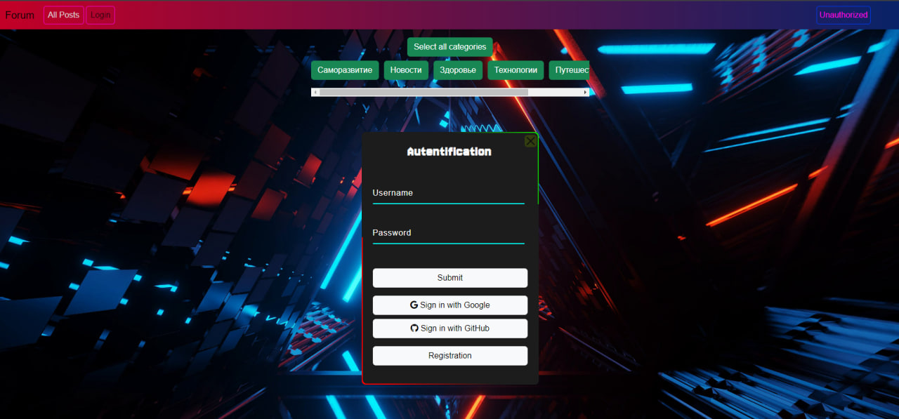
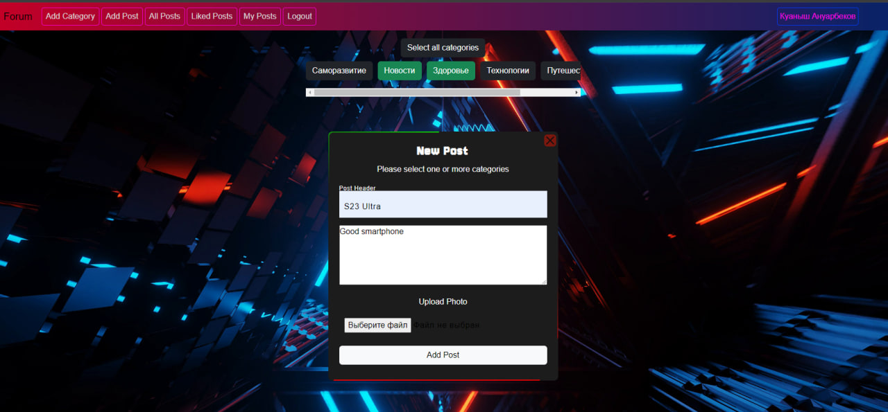
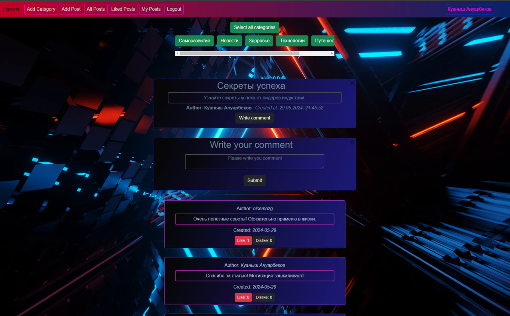

# Форум

Привет! Добро пожаловать в проект "Форум". Приложение представляет собой SPA (Single Page Application), реализованный на Vanilla JS.
Это веб-приложение, разработанное на языке программирования Go, предназначенное для создания и ведения обсуждений на различные темы.

## Использование

* Регистрация и аутентификация.
* Регистрация и аутентификация через google и github.
* Загрузка img файлов в S3 хранилище.
* Создавать и редактировать категории обсуждений.
* Создавать, просматривать и удалять темы обсуждений.
* Оставлять комментарии к темам.
* Оставлять лайки и дизлайки к темам и комментариям.

## Стек технологий:

На сервере:
1. Язык программирования Go (Golang):
* Использовался для разработки серверной части приложения.
* Применяется для обработки запросов, взаимодействия с базой данных, а также для создания веб-сервера.
2. База данных SQLight3:
* Используется для хранения данных о пользователях, категориях, темах и комментариях.
* Обеспечивает доступ к данным и простоту интеграции с проектом.

На клиенте:
1. Vanilla JavaScript:
* Использовался для разработки клиентской части приложения.
* Позволяет создавать интерактивные элементы и обрабатывать пользовательские события на веб-странице без использования фреймворков или библиотек.
2. HTML и CSS:
* Используются для создания структуры и стилизации веб-страницы.
3. Bootstrap:
* Используется для создания адаптивного дизайна и упрощения стилизации элементов.

Дополнительно:
1. REST FULL API
2. Fetch API
3. Midleware
4. Session Token
5. S3 хранилище
6. Docker

### Команда для запуска:
```go
go run main.go
```

Для того чтобы сделать миграцию базы данных, необходимо выполнить команду:

1. Установить migrate 
```bash
go install -tags 'postgres sqlite3' github.com/golang-migrate/migrate/v4/cmd/migrate@latest
```
2. Создать файл конфигурации к примеру:
```bash
migrate create -ext sql -dir ./migrations -seq add_firstName_to_users_table
```
3. Комманды для миграций
  + Накатить для OS MAC migrate 
    ```bash
    -database sqlite3://$(pwd)/database/forum.db -path ./migrations up
    ```
  + Откатить для OS MAC migrate
    ```bash
    -database sqlite3://$(pwd)/database/forum.db -path ./migrations down
    ```
  + Накатить для OS WINDOWS
    ```bash
    migrate -database sqlite3://./database/forum.db -path ./migrations up
    ```
  + Откатить для OS WINDOWS
    ```bash
    migrate -database sqlite3://./database/forum.db -path ./migrations down
    ```

###     Contacts:

+ [Telegram](https://t.me/nicemozgg)
+ [WhatsApp](https://Wa.me/+77064441111)





